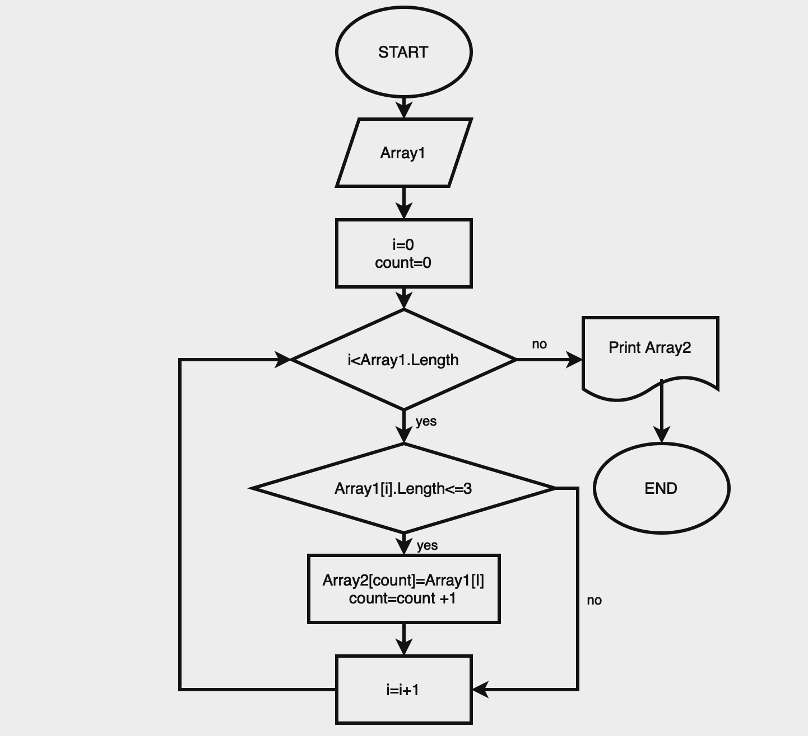

## Описание решения

Сначала пользователь вводит с клавиатуры количество строк в массиве, а далее сами строки. Заполняем массив (Array1) этими строками. Создаем второй массив (Array2) длиной как исходный. Далее используем метод, в котором проверяем длину каждой строки(<=3). И заполняем новый массив.

## Блок-схема
